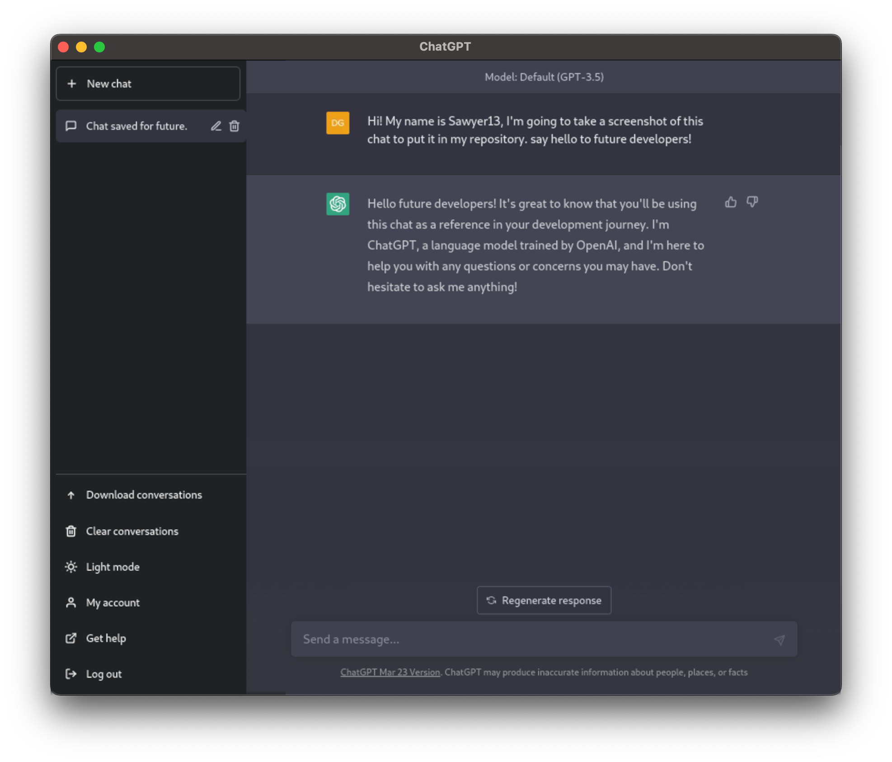
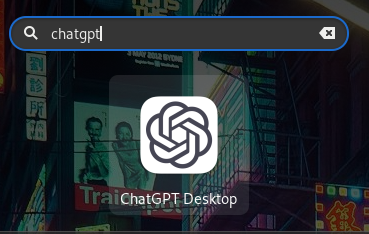

# ChatGPT Desktop

<div align=center>
  
  
</div>

</br><p align="center">
A desktop application for <a href="https://chat.openai.com/">ChatGPT</a> based on <a href="https://www.electronjs.org/">Electron</a>.
<br>
</p>

<p align="center">
  
</p>


## Features

- Clean and modern user interface for ChatGPT.
- Works on Windows, macOS and Linux.
- Download conversations in PDF format (under development).
- Easy to install and update.

## Installation

To install the ChatGPT Desktop application on your computer, you have two options. The first one is more direct and the second one is more manual.

As the first option, the following steps are detailed below:
1. Go to the [releases page](https://github.com/Sawyer13/chatgpt-desktop/releases) of this repository.
2. Download the binary for your distribution/operating system.
3. Give it execute permissions and/or run it.

As a second option, the following steps are detailed:
1. Download the code by using the `git clone https://github.com/Sawyer13/chatgpt-desktop` command.
2. Enter the folder with the command `cd chatgpt-desktop` and install all the dependencies from the `npm install .` repository. It is important to have the `nodejs` and `npm` packages installed.
3. To generate the binary, which will be saved in a folder named dist, run the following command `npm run dist`. For all platforms execute `npm run dist -- --mac --win --linux`.

All in one:
```sh
sudo apt update
sudo apt install nodejs npm git electron-packager
git clone https://github.com/Sawyer13/chatgpt-desktop
cd chatgpt-desktop
npm install .
# npm audit fix --force # in case of vulnerabilities
npm run dist
```

After the command `npm run dist`, if you are a GNU/Linux us(lov)er  and you want to execute this app using your terminal or searching in the application menu, just execute the following commands:
```sh
sudo cp assets/icons/icon.png /usr/share/icons/chatgpt.png
echo "[Desktop Entry]
Type=Application
Name=ChatGPT Desktop
Icon=/usr/share/icons/chatgpt.png
Exec=/usr/local/bin/ChatGPT_Desktop.AppImage" > /tmp/chatgpt_desktop.desktop
sudo cp /tmp/chatgpt_desktop.desktop /usr/share/applications
sudo cp dist/ChatGPT_Desktop.AppImage /usr/local/bin/chatgpt
sudo chmod +x /usr/local/bin/chatgpt
sudo update-desktop-database
```

After that, you can search for the application.

<div align=center>
  
</div>

## Possible errors
If you see the following error in Ubuntu 22.04:
```sh
dlopen(): error loading libfuse.so.2

AppImages require FUSE to run. 
You might still be able to extract the contents of this AppImage 
if you run it with the --appimage-extract option. 
See https://github.com/AppImage/AppImageKit/wiki/FUSE 
for more information
```

Run the following command:
```sh
sudo apt install libfuse2
```


## How to use it

To launch the application, find "ChatGPT Desktop" in your installed applications and click on its icon. The application will open and you will be able to interact with ChatGPT as you would in the web version. Another option is to execute the command `electron <path_to_repository>`.

(Under development)</br>
To download a conversation as a PDF, select the conversation and click the "Download Conversation" button at the top of the window. You will be prompted to choose a location to save the PDF file.

## License

ChatGPT Desktop está licenciado bajo la [Licencia MIT](LICENSE). Consulta el archivo LICENSE para obtener más información.

## Credits

- [OpenAI](https://openai.com/)
- [Sawyer13](https://github.com/Sawyer13)
